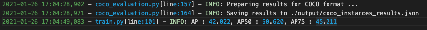

# Sparsercnn_without_detectron2
- Sparse R-CNN: End-to-End Object Detection with Learnable Proposals
- depend on https://github.com/PeizeSun/SparseR-CNN
## requirements
- pycocotools
- fvcore
- PyTorch ≥ 1.5
- opencv
- torchvision==0.8.2

## how to train
- mkdir -p datasets/coco
- ln -s /path_to_coco_dataset/annotations datasets/coco/annotations
- ln -s /path_to_coco_dataset/train2017 datasets/coco/train2017
- ln -s /path_to_coco_dataset/val2017 datasets/coco/val2017
- ./train_coco.sh

# pretrain model
- https://pan.baidu.com/s/1pC_dvTBwMSVQV6pUaZRU2Q （提取码：e8ip）

## test
- ./test.sh

## If it helps you, give me a star please
